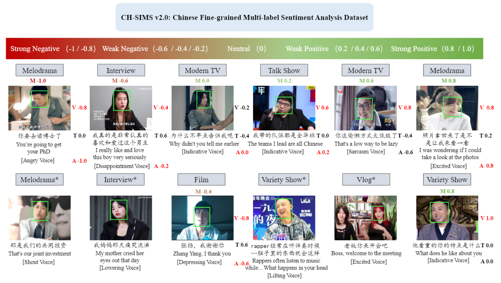
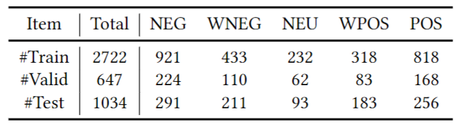

# CH-SIMS-v2.0

Official codes for paper "Make Acoustic and Visual Cues Matter: CH-SIMS v2.0 Dataset and AV-Mixup Consistent Module" (ICMI 2022)

### Illustration of the constructed CH-SIMS v2.0 data
<p align="center">
  
</p>

### Official Baselines results
<p align="center">
  
</p>

### Data split
<p align="center">
  
</p>

### Data Download

1.The extracted modality features files:
  1) Supervised standard pickle file(ch-simsv2s.pkl) and meta file(meta(s).csv)
      Google Drive[https://drive.google.com/drive/folders/1wFvGS0ebKRvT3q6Xolot-sDtCNfz7HRA?usp=sharing]
  2) Unsupervised standard pickle file(ch-simsv2u.pkl) and meta file(meta(u).csv)
      Google Drive[https://drive.google.com/drive/folders/1llIbm3gwyJRwwk58RUQHWBNKjHI9vGGB?usp=sharing]

2. The raw video files:
  1) Supervised raw video file(ch-simsv2s.zip)
      Google Drive[https://drive.google.com/drive/folders/1wFvGS0ebKRvT3q6Xolot-sDtCNfz7HRA?usp=sharing]
  2) Unsupervised raw video file(ch-simsv2u.pkl)
      Google Drive[https://drive.google.com/drive/folders/1wFvGS0ebKRvT3q6Xolot-sDtCNfz7HRA?usp=sharing]

### Data path

config/config.py --> modify parameter "root_dataset_dir" line 32 of your dataset path

### Run
If you want to run the AV-MC framework: 

```
python run.py --is_tune Flase --modelName v1
```

If you want to run the AV-MC(Semi) framework 

```
python run.py --is_tune Flase --modelName v1_semi
```
### Citation

If this paper is useful for your research, please cite us at: 

### Contact

For any questions, please email at liuyihe(512796310@qq.com) & yuanziqi(yzq21@mails.tsinghua.edu.cn)
