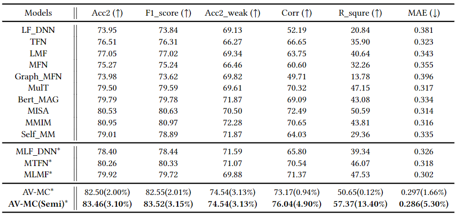

# CH-SIMS-v2.0
Make Acoustic and Visual Cues Matter: CH-SIMS v2.0 Dataset and AV-Mixup Consistent Module
### Illustration of the constructed CH-SIMS v2.0 data

  

### Models results

  

### Data split

  

### Data Download

Please look at the html()

### Data path

config/config.py --> modify parameter "root_dataset_dir" line 32 of your dataset path

### Run
If you want to run the AV-MC framework: python run.py --is_tune Flase --modelName v1

If you want to run the AV-MC(Semi) framework python run.py --is_tune Flase --modelName v1_semi

### Citation

If this paper is useful for your research, please cite us at: 

### Contact

For any questions, please email at liuyihe(512796310@qq.com) & yuanziqi(yzq21@mails.tsinghua.edu.cn)